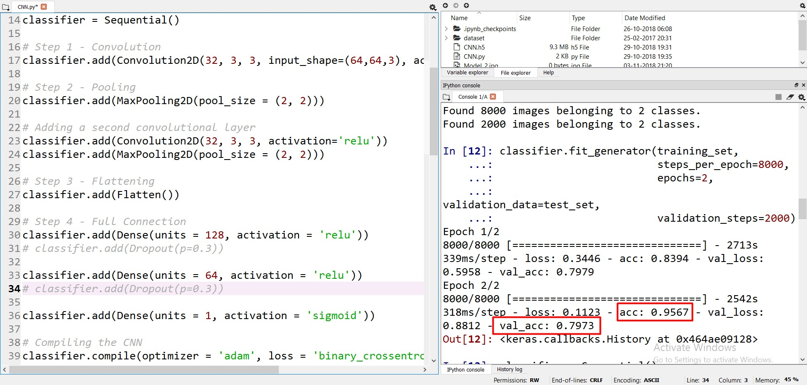
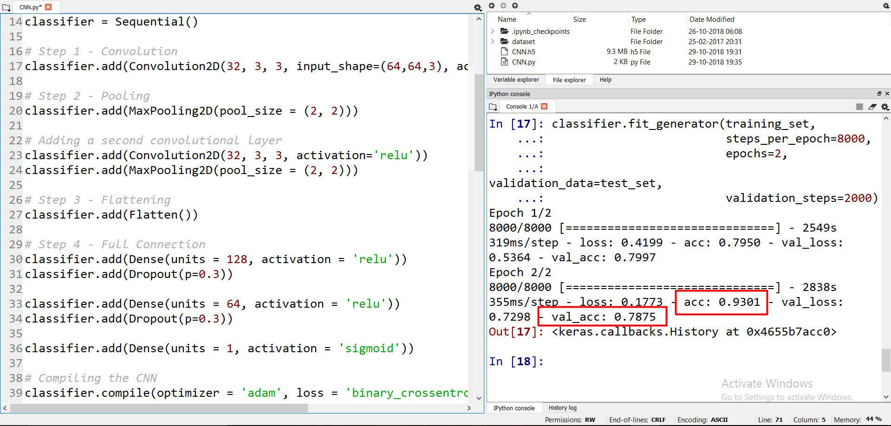
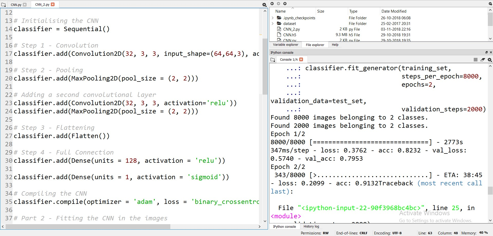

# Convolutional-Neural-Networks
CNN model to classify images of cats and dogs.                                                                                              
**Dataset available at:** http://www.superdatascience.com/wp-content/uploads/2017/04/Convolutional_Neural_Networks.zip          
* ## Model - 1(a):
  * Two Convolutional Layer with a pooling layer each
  * Two fully connected layer
  * A single output layer                                                                             
                                   

The model **Overfitted**.
                                               
* ## Model - 1(b):
  * Previous model with Dropout                                                          
                           
                                           

This model **Overfitted** too but with less Training accuracy.                                    

* ## Model - 2:
  * Two Convolutional Layer with a pooling layer each
  * Single fully connected layer
  * Single output layer                                                                  
   
                                                                 
   
   This model was also starting to **Overfit**. 
